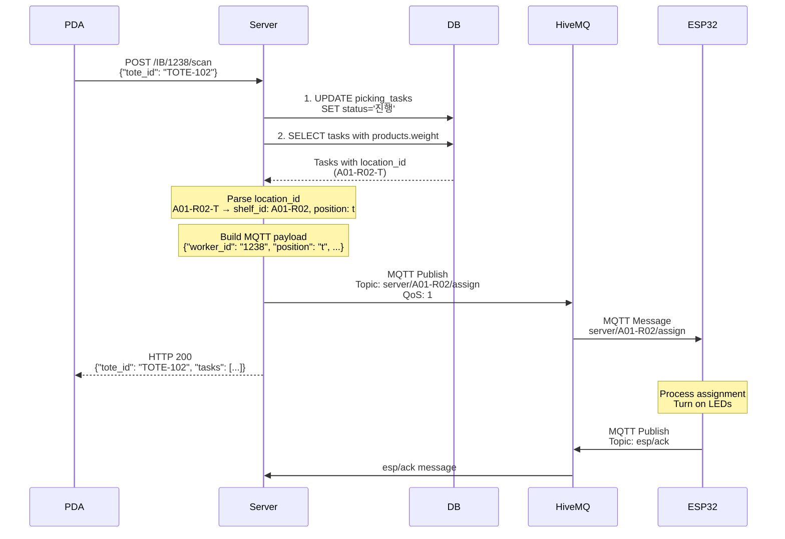

# API ↔ MQTT 통합 플로우

## 전체 시스템 플로우



## 상세 구현 플로우

### 1. 스캔 API 호출

**요청**:
```http
POST /IB/1238/scan HTTP/1.1
Content-Type: application/json

{
  "tote_id": "TOTE-102"
}
```

### 2. 데이터베이스 처리

**SQL 실행 순서**:
```sql
-- 1. 태스크 상태 업데이트
UPDATE picking_tasks 
SET status = '진행', assigned_worker_id = '1238'
WHERE tote_id = 'TOTE-102' AND work_type = 'IB' AND status = '대기';

-- 2. 진행 태스크 조회 (제품 무게 포함)
SELECT 
  pt.task_id,
  pt.product_id,
  pt.quantity,
  pt.location_id,
  pt.priority,
  p.name as product_name,
  p.weight as product_weight
FROM picking_tasks pt
JOIN products p ON pt.product_id = p.product_id
WHERE pt.tote_id = 'TOTE-102' 
  AND pt.work_type = 'IB' 
  AND pt.status = '진행'
ORDER BY pt.priority ASC;
```

### 3. 위치 ID 파싱

**변환 로직**:
```javascript
// 입력: "A01-R02-T"
const [zoneRaw, rackRaw, posRaw] = location_id.split('-');
// zoneRaw: "A01", rackRaw: "R02", posRaw: "T"

const shelf_id = `${zoneRaw}-${rackRaw}`;  // "A01-R02"
const position = posRaw?.toLowerCase() === 't' ? 't' : 'b';  // "t"
```

### 4. MQTT 페이로드 구성

**코드**:
```javascript
const payload = {
  worker_id: "1238",
  position: "t",
  work_type: "IB",
  products: tasks
    .filter(t => t.location_id === firstTask.location_id)
    .map(t => ({
      product_id: String(t.product_id),
      weight: t.product_weight != null ? String(t.product_weight) : null,
      quantity: t.quantity,
    }))
};
```

**결과 예시**:
```json
{
  "worker_id": "1238",
  "position": "t",
  "work_type": "IB",
  "products": [
    {
      "product_id": "2",
      "weight": "1.5",
      "quantity": 1
    }
  ]
}
```

### 5. MQTT 발행

**발행 코드**:
```javascript
await publishAssignToShelf(shelf_id, payload, { qos: 1, retain: false });
```

**실제 발행**:
- **토픽**: `server/A01-R02/assign`
- **메시지**: JSON 페이로드
- **QoS**: 1 (최소 한 번 전달 보장)
- **Retain**: false (브로커에 저장하지 않음)

### 6. HTTP 응답

**응답 형태**:
```json
{
  "tote_id": "TOTE-102",
  "worker_id": "1238",
  "work_type": "IB",
  "tasks": [
    {
      "task_id": 123,
      "product_id": 2,
      "product_name": "탄산음료 1.5L",
      "quantity": 1,
      "location_id": "A01-R02-T",
      "priority": 1
    }
  ],
  "message": "1 tasks started"
}
```

## 에러 처리 플로우

### 1. 토트 ID 없음
```javascript
if (!tote_id) {
  return new Response('tote_id is required', { status: 400 });
}
```

### 2. 대기 중인 태스크 없음
```javascript
if (updateResult.rowCount === 0) {
  return new Response('No available tasks for this tote', { status: 404 });
}
```

### 3. MQTT 발행 실패
```javascript
try {
  await publishAssignToShelf(shelf_id, payload, { qos: 1, retain: false });
} catch (e) {
  console.error('MQTT publish 실패:', e);
  // HTTP 응답은 정상 처리 (MQTT 실패가 API를 중단시키지 않음)
}
```

## 위치 매핑 규칙

### 데이터베이스 위치 형식
- **도메인**: `location_id_dom`
- **패턴**: `^[A-Z][0-9]{2}-R[0-9]{2}-[TB]$`
- **예시**: `A01-R02-T`, `B03-R15-B`

### MQTT 토픽 변환
| DB location_id | shelf_id | position | MQTT Topic |
|---------------|----------|----------|------------|
| A01-R02-T | A01-R02 | t | server/A01-R02/assign |
| A01-R02-B | A01-R02 | b | server/A01-R02/assign |
| B03-R15-T | B03-R15 | t | server/B03-R15/assign |

### ESP32 구독 패턴
```javascript
// 각 ESP32는 자신의 선반 ID로 구독
mqtt.subscribe("server/A01-R02/assign");
mqtt.subscribe("server/A01-R03/assign");
// 또는 와일드카드 사용
mqtt.subscribe("server/+/assign");
```

## 성능 고려사항

### 1. 동시 스캔 처리
- **문제**: 같은 토트에 대한 동시 스캔
- **해결**: 데이터베이스 트랜잭션으로 원자성 보장

### 2. MQTT 연결 관리
- **문제**: 요청마다 새로운 연결 생성
- **해결**: 싱글톤 클라이언트 재사용

### 3. 대용량 메시지
- **현재**: 작은 JSON 페이로드 (~1KB 미만)
- **확장**: 이미지나 대용량 데이터는 별도 저장소 사용

## 확장성 고려사항

### 1. 다중 선반 지원
```json
{
  "worker_id": "1238",
  "work_type": "IB",
  "assignments": [
    {
      "shelf_id": "A01-R02",
      "position": "t",
      "products": [...]
    },
    {
      "shelf_id": "A01-R03", 
      "position": "b",
      "products": [...]
    }
  ]
}
```

### 2. 우선순위 기반 라우팅
```javascript
// 높은 우선순위는 별도 토픽으로 발행
const topic = priority > 5 
  ? `server/${shelf_id}/assign/urgent`
  : `server/${shelf_id}/assign`;
```

### 3. 배치 처리
```javascript
// 여러 태스크를 하나의 메시지로 묶어서 발행
const batchSize = 10;
const batches = chunk(tasks, batchSize);
for (const batch of batches) {
  await publishBatch(shelf_id, batch);
}
```
